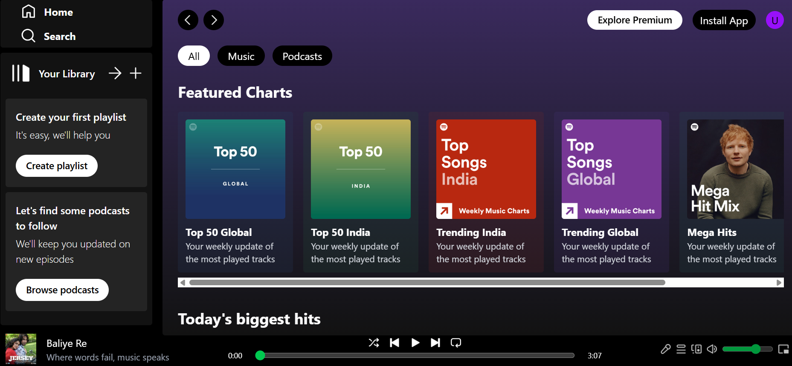

# 🎵 Spotify Clone

A modern and responsive **Spotify-inspired music streaming web application** built with **React**, **Vite**, and **Tailwind CSS**. This project replicates the look and feel of Spotify while providing a smooth and engaging user experience.

---

## 🚀 Live Demo

🌐 **Live Website:**  
https://spotify-clone-ebon-chi.vercel.app/

💻 **GitHub Repository:**  
https://github.com/aman0117-crypto/spotify-clone

---

## ✨ Features

- 🎵 Spotify-inspired modern UI
- 📱 Fully responsive design
- 🎧 Music player interface
- 🎼 Playlist layout
- 🔍 Search interface
- ⚡ Fast performance powered by Vite
- 🎨 Beautiful UI with Tailwind CSS

---

## 🛠️ Tech Stack

- React.js
- Vite
- Tailwind CSS
- JavaScript (ES6+)
- HTML5
- CSS3

---

## 📸 Preview

> Add a screenshot of your homepage and name it **preview.png**.



---

## 📂 Folder Structure

```text
spotify-clone/
│── public/
│── src/
│── assets/
│── package.json
│── vite.config.js
│── README.md
```

---

## ⚙️ Installation

Clone the repository

```bash
git clone https://github.com/aman0117-crypto/spotify-clone.git
```

Go to the project directory

```bash
cd spotify-clone
```

Install dependencies

```bash
npm install
```

Run the development server

```bash
npm run dev
```

Build for production

```bash
npm run build
```

---

## 📈 Future Improvements

- 🔐 User Authentication
- ❤️ Favorite Songs
- 🎼 Custom Playlists
- 🔊 Volume Controls
- 🎶 Music Streaming API Integration
- 🌙 Dark/Light Theme

---

## 👨‍💻 Author

**Aman Gupta**

📧 Email: **amang954817@gmail.com**

💼 LinkedIn:  
https://www.linkedin.com/in/aman-gupta-0474122b8

🌐 Portfolio:  
https://aman0117-crypto.github.io/Portfolio/

🐙 GitHub:  
https://github.com/aman0117-crypto

---

## ⭐ Support

If you like this project, please consider giving it a **⭐ Star** on GitHub.

It motivates me to build more awesome projects!
